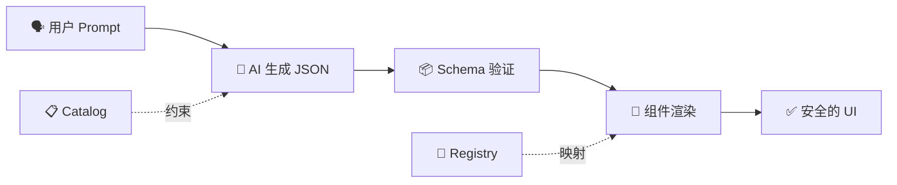

欢迎阅读 **Die Yi 技术周刊** 第 2 期！🎉

本期我们聊聊如何让 Vibe Coding 变得更可控——从前端 UI 生成的"护栏"到开发流程的"规范驱动"，让 AI 编程不再是盲猜！

让我们开始吧！

**本期目录：**

- 🤖 前端 Vibe Coding 的银弹? json-render 是这颗银弹吗?
- 🎯 SpecKit 规范驱动开发: 要不试试 OpenSpec ?
- 📮 下期预告

<!-- truncate -->

---

## 🤖 前端 Vibe Coding 的银弹? json-render 是这颗银弹吗?

> **让 AI 只能用你定义的组件！前端生成式 UI 的安全之道**

### 痛点

想过让用户通过 prompt 生成 UI 吗？

- "帮我生成一个销售数据 Dashboard"
- "创建一个客户信息编辑表单"

听起来很酷，但问题来了：

- AI 生成的前端代码质量参差不齐，今天能用明天报错
- 直接渲染 AI 输出的 HTML/JSX？安全风险太大了！
- 生成的 UI 风格和你的设计系统完全不搭

### 解决方案

[**json-render**](https://github.com/vercel-labs/json-render) 是 Vercel Labs 推出的一个新思路：**AI → JSON → UI**

核心理念很简单：**给 AI 一个受限的词汇表**。AI 只能生成你预定义组件的 JSON 描述，然后由你的代码来渲染。这样输出永远是可预测的！



_🤫 这就像给 AI 一本"菜单"，它只能点菜单上有的菜，不能自己乱发明！_

### 核心特性

| 功能            | 说明                                 |
| --------------- | ------------------------------------ |
| 🛡️ **护栏**     | AI 只能使用 Catalog 中定义的组件     |
| 🎯 **可预测**   | JSON 输出符合你的 Schema，每次都一致 |
| ⚡ **流式渲染** | 边生成边渲染，响应更快               |
| 🔐 **条件可见** | 基于数据/权限控制组件显示            |
| ✅ **内置验证** | 表单验证开箱即用                     |

### 快速上手

**安装：**

```bash
npm install @json-render/core @json-render/react
```

**三步走：**

**Step 1：定义 Catalog（AI 能用什么）**

```tsx
import { createCatalog } from "@json-render/core";
import { z } from "zod";

const catalog = createCatalog({
  components: {
    Card: {
      props: z.object({ title: z.string() }),
      hasChildren: true,
    },
    Metric: {
      props: z.object({
        label: z.string(),
        valuePath: z.string(),
        format: z.enum(["currency", "percent", "number"]),
      }),
    },
    Button: {
      props: z.object({
        label: z.string(),
        action: ActionSchema,
      }),
    },
  },
  actions: {
    export_report: { description: "Export dashboard to PDF" },
    refresh_data: { description: "Refresh all metrics" },
  },
});
```

**Step 2：注册组件（怎么渲染）**

```tsx
const registry = {
  Card: ({ element, children }) => (
    <div className="card">
      <h3>{element.props.title}</h3>
      {children}
    </div>
  ),
  Metric: ({ element }) => {
    const value = useDataValue(element.props.valuePath);
    return <div className="metric">{format(value)}</div>;
  },
  Button: ({ element, onAction }) => (
    <button onClick={() => onAction(element.props.action)}>
      {element.props.label}
    </button>
  ),
};
```

**Step 3：让 AI 生成！**

```tsx
import {
  DataProvider,
  ActionProvider,
  Renderer,
  useUIStream,
} from "@json-render/react";

function Dashboard() {
  const { tree, send } = useUIStream({ api: "/api/generate" });

  return (
    <DataProvider initialData={{ revenue: 125000, growth: 0.15 }}>
      <ActionProvider
        actions={{
          export_report: () => downloadPDF(),
          refresh_data: () => refetch(),
        }}
      >
        <input
          placeholder="Create a revenue dashboard..."
          onKeyDown={(e) => e.key === "Enter" && send(e.target.value)}
        />
        <Renderer tree={tree} components={registry} />
      </ActionProvider>
    </DataProvider>
  );
}
```

就这样！AI 生成 JSON，你安全渲染。

### 适用场景

- 🎛️ 让用户自助生成 Dashboard
- 📊 AI 驱动的数据可视化
- 📝 动态表单生成器
- 🎨 终端用户自定义 UI

### 性能与限制

你可能会问：JSON 序列化会不会有性能问题？

| 关注点         | 实际情况                                  |
| -------------- | ----------------------------------------- |
| **序列化延迟** | JSON 结构简单，序列化开销可忽略不计       |
| **流式渲染**   | 支持边生成边渲染，用户无需等待完整响应    |
| **复杂交互**   | 通过 Actions + onSuccess/onError 回调支持 |
| **嵌套组件**   | 通过 `hasChildren: true` 支持任意嵌套     |

> 💡 **Tip**: 对于复杂交互场景，建议将业务逻辑放在 `ActionProvider` 中处理，保持 JSON 结构的简洁。

🔗 **相关链接：**

- GitHub: [vercel-labs/json-render](https://github.com/vercel-labs/json-render)

---

## 🎯 SpecKit 规范驱动开发: 要不试试 OpenSpec ?

> **别让 AI 盲猜了！用规范文档约束 LLM 行为**

### 痛点

AI 编程助手非常强大，但当需求只存在于聊天记录里时...

- "这个按钮点击后应该做什么来着？" → AI：让我猜猜...
- 模糊的 prompt 导致不可预测的结果
- 改完了发现和预期不一样？再改一版！又不对？再来！

**Vibe Coding 的问题不是 AI 不够聪明，而是我们没说清楚要什么。**

### 解决方案

[**OpenSpec**](https://github.com/Fission-AI/OpenSpec) 是一个规范驱动开发 (Spec-Driven Development) 框架。

核心理念：**先约定要做什么，再写代码**。

每个功能改动都有自己的文件夹，包含完整的规划文档：

```
openspec/changes/add-dark-mode/
├── proposal.md    # 为什么做、改什么
├── specs/         # 需求和场景
├── design.md      # 技术方案
└── tasks.md       # 实现清单
```

_🤫 这就像给 AI 一份"施工图纸"，而不是只告诉它"盖个房子"！_

### 实战示例：添加深色模式

假设你要给项目加一个深色模式功能，看看 OpenSpec 会生成什么：

**📁 `openspec/changes/add-dark-mode/proposal.md`**

```markdown
# 添加深色模式

## 背景

用户反馈夜间使用时屏幕太亮，影响体验。

## 目标

实现深色/浅色主题切换，记住用户偏好。

## 非目标（不做）

- 自定义主题色（后续迭代）
- 跟随系统主题自动切换（后续迭代）
```

**📁 `openspec/changes/add-dark-mode/specs/scenarios.md`**

```markdown
## 场景 1：切换到深色模式

- 用户点击主题切换按钮
- ✅ 页面立即切换为深色主题
- ✅ 偏好保存到 localStorage

## 场景 2：刷新页面保持主题

- 用户刷新页面
- ✅ 自动恢复上次选择的主题

## 场景 3：首次访问

- 新用户首次访问
- ✅ 默认使用浅色主题
```

**📁 `openspec/changes/add-dark-mode/design.md`**

```markdown
## 技术方案

### 状态管理

- ThemeContext 提供全局主题状态
- useTheme hook 供组件使用

### 样式实现

- CSS 变量定义颜色 token
- [data-theme="dark"] 选择器覆盖

### 持久化

- localStorage 存储用户偏好
- 页面加载时读取并应用
```

**📁 `openspec/changes/add-dark-mode/tasks.md`**

```markdown
- [ ] 1. 基础设施
  - [ ] 1.1 Add theme context provider
  - [ ] 1.2 Create toggle component
- [ ] 2. 样式
  - [ ] 2.1 Add CSS variables
  - [ ] 2.2 Wire up localStorage
- [ ] 3. 测试
  - [ ] 3.1 主题切换单元测试
  - [ ] 3.2 持久化功能测试
```

有了这套文档，AI 就不会"盲猜"你要什么了！

### 核心特性

| 功能          | 说明                             |
| ------------- | -------------------------------- |
| 📝 **结构化** | 每个改动一个文件夹，规范清晰     |
| 🤝 **对齐**   | 人和 AI 先在规范上达成一致       |
| 🔄 **灵活**   | 随时更新任何文档，没有死板流程   |
| 🔧 **兼容**   | 支持 20+ AI 工具，用斜杠命令调用 |

### 工作流演示

```
You: /opsx:new add-dark-mode
AI:  Created openspec/changes/add-dark-mode/
     Ready to create: proposal

You: /opsx:ff  # "fast-forward" - 一键生成全套规划
AI:  ✓ proposal.md — 为什么做、改什么
     ✓ specs/      — 需求和场景
     ✓ design.md   — 技术方案
     ✓ tasks.md    — 实现清单
     Ready for implementation!

You: /opsx:apply
AI:  Implementing tasks...
     ✓ 1.1 Add theme context provider
     ✓ 1.2 Create toggle component
     ✓ 2.1 Add CSS variables
     ✓ 2.2 Wire up localStorage
     All tasks complete!

You: /opsx:archive
AI:  Archived to openspec/changes/archive/2025-01-23-add-dark-mode/
     Ready for the next feature.
```

### 快速上手

**安装：**

```bash
npm install -g @fission-ai/openspec@latest
```

**初始化项目：**

```bash
cd your-project
openspec init
```

**开始使用：**

告诉你的 AI 助手：`/opsx:new <what-you-want-to-build>`

### 与其他方案对比

| 方案            | 特点                       |
| --------------- | -------------------------- |
| **OpenSpec**    | 轻量、灵活、支持 20+ 工具  |
| GitHub Spec Kit | 完整但重，有严格的阶段门禁 |
| AWS Kiro        | 强大但锁定 IDE 和模型      |
| 什么都不用      | 模糊 prompt → 不可预测结果 |

### 团队协作：CI/CD 集成

工程主管可能会问：这东西怎么和现有流程集成？

**Git 工作流整合：**

```
开发者提交 → PR 包含 openspec/changes/xxx/ → Review 规范文档 → 合并后自动归档
```

**CI 检查建议：**

- ✅ 检查是否有对应的 spec 文件夹
- ✅ 验证 tasks.md 是否全部完成
- ✅ PR 描述自动引用 proposal.md 内容

**团队规范示例：**

```yaml
# .github/workflows/spec-check.yml
name: Spec Check
on: pull_request
jobs:
  check:
    runs-on: ubuntu-latest
    steps:
      - name: Verify spec exists
        run: |
          if [ ! -d "openspec/changes" ]; then
            echo "⚠️ Missing OpenSpec documentation"
          fi
```

> 💡 **Tip**: 将规范文档作为 PR 的一部分，让 Code Review 不只是看代码，还要看设计意图。

🔗 **相关链接：**

- GitHub: [Fission-AI/OpenSpec](https://github.com/Fission-AI/OpenSpec)
- 文档: [Getting Started](https://github.com/Fission-AI/OpenSpec/blob/main/docs/getting-started.md)

---

## 📮 下期预告

下周我们将关注：

- 更多 AI 编程最佳实践
- 你的投稿！

---

_有推荐的项目或话题？欢迎反馈给我们！_
